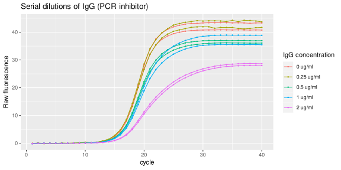

<!-- README.md is generated from README.Rmd. Please edit that file -->

# guescini

<!-- badges: start -->

[](https://CRAN.R-project.org/package=guescini)
<!-- badges: end -->

`{guescini}` is an R data package that provides real-time PCR raw
fluorescence data by Guescini et al. (2008) in tidy format.

## Installation

Install `{guescini}` from CRAN:

``` r
# Install from CRAN
install.packages("guescini")
```

You can install the development version of `{guescini}` like so:

``` r
# install.packages("remotes")
remotes::install_github("ramiromagno/guescini")
```

## Data

Guescini et al. (2008) explored the effect of amplification inhibition
on qPCR quantification. Two systems were devised to alter the
amplification efficiency:

- decreasing of the amplification mix used in the reaction
- increasing of IgG (PCR inhibitor) concentration in the reaction

The raw fluorescence data associated with the decreasing of the
amplification mix is provided as the data set `amp_mix_perc`; the data
obtained with increasing concentrations of IgG is provided as
`IgG_inhibition`.

### Amplification mix percentage

The data set `amp_mix_perc` corresponds to a set of amplification runs
where the MT-ND1 gene is amplified in reactions having the same initial
amount of DNA but different amounts of SYBR Green I Master mix. A
standard curve was performed over a wide range of input DNA
($3.14 \times 10^7\ \text{thru}\ 3.14 \times 10^1$) in the presence of
optimal amplification conditions (100% amplification mix), while the
unknowns were run in the presence of the same starting DNA amounts but
with amplification mix quantities ranging from 60% to 100%.

``` r
library(guescini)
amp_mix_perc
#> # A tibble: 21,000 × 12
#>    plate well  dye   target sample_…¹ run   repli…² amp_m…³ copies dilut…⁴ cycle
#>    <fct> <fct> <fct> <fct>  <fct>     <fct> <fct>     <dbl>  <int>   <int> <int>
#>  1 <NA>  <NA>  SYBR  MT-ND1 std       1     1             1 3.14e7       1     1
#>  2 <NA>  <NA>  SYBR  MT-ND1 std       1     1             1 3.14e7       1     2
#>  3 <NA>  <NA>  SYBR  MT-ND1 std       1     1             1 3.14e7       1     3
#>  4 <NA>  <NA>  SYBR  MT-ND1 std       1     1             1 3.14e7       1     4
#>  5 <NA>  <NA>  SYBR  MT-ND1 std       1     1             1 3.14e7       1     5
#>  6 <NA>  <NA>  SYBR  MT-ND1 std       1     1             1 3.14e7       1     6
#>  7 <NA>  <NA>  SYBR  MT-ND1 std       1     1             1 3.14e7       1     7
#>  8 <NA>  <NA>  SYBR  MT-ND1 std       1     1             1 3.14e7       1     8
#>  9 <NA>  <NA>  SYBR  MT-ND1 std       1     1             1 3.14e7       1     9
#> 10 <NA>  <NA>  SYBR  MT-ND1 std       1     1             1 3.14e7       1    10
#> # … with 20,990 more rows, 1 more variable: fluor <dbl>, and abbreviated
#> #   variable names ¹​sample_type, ²​replicate, ³​amp_mix_perc, ⁴​dilution

amp_mix_perc %>%
  ggplot(mapping = aes(
    x = cycle,
    y = fluor,
    group = interaction(run, amp_mix_perc, copies),
    col = format(copies, big.mark = ",", scientific = FALSE)
  )) +
  geom_line(linewidth = 0.2) +
  geom_point(size = 0.2) +
  labs(y = "Raw fluorescence", colour = "No. of copies", title = "Seven-point 10-fold dilution series amplification mix percentage") +
  guides(color = guide_legend(override.aes = list(linewidth = 0.5), reverse = TRUE)) +
  facet_wrap(vars(amp_mix_perc))
```


### Inhibition by IgG

The data set `IgG_inhibition` provides those runs performed in the
presence of an optimal amplification reaction mix added with serial
dilutions of IgG (0.0 - 2 ug/ml) thus acting as the inhibitory agent.

``` r
IgG_inhibition %>%
  ggplot(mapping = aes(
    x = cycle,
    y = fluor,
    group = interaction(IgG_conc, replicate),
    col = paste(as.character(IgG_conc), "ug/ml")
  )) +
  geom_line(linewidth = 0.5) +
  geom_point(size = 0.5) +
  labs(y = "Raw fluorescence", colour = "IgG concentration", title = "Serial dilutions of IgG (PCR inhibitor)") +
  guides(color = guide_legend(override.aes = list(linewidth = 0.5)))
```



## Code of Conduct

Please note that the guescini project is released with a [Contributor
Code of
Conduct](https://contributor-covenant.org/version/2/1/CODE_OF_CONDUCT.html).
By contributing to this project, you agree to abide by its terms.

## References

Michele Guescini, Davide Sisti, Marco BL Rocchi, Laura Stocchi and
Vilberto Stocchi. *A new real-time PCR method to overcome significant
quantitative inaccuracy due to slight amplification inhibition*. BMC
Bioinformatics 9:326 (2008). doi:
[10.1186/1471-2105-9-326](https://doi.org/10.1186/1471-2105-9-326).
